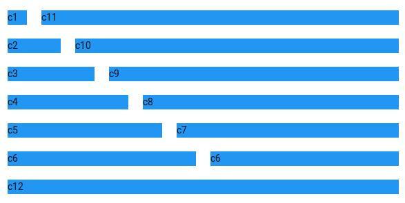

# Level 1

Create classes for Grid layout. Grid contains Row `row` and Column `col`. Each column has 12 cells. The element with class `cx` will occupy x cells in the row [for eg. c6 will occupy 6 cells i.e. half the row].
The styling must be done in `style.css` and the effects that will be seen in `index.html` should be as follows:

_Note_ that you only need to code in css, and html should be kept as it is.
